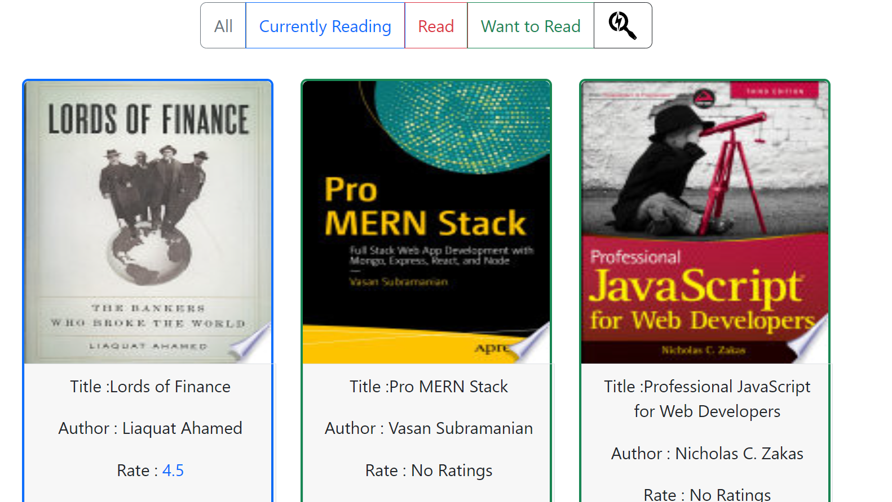

<h2>React App using api, Hooks and Functional Components </h2>

#
## Description:

This Project made to fetch apis and update on them using hooks.It's a bookshelf app that allows you to select and categorize books to currently reading, read or want to read Sections. The app was made using React with api server that brings data and you can edit on it freely.

#
## To run this project

```
npm i
```

```
npm start
```


